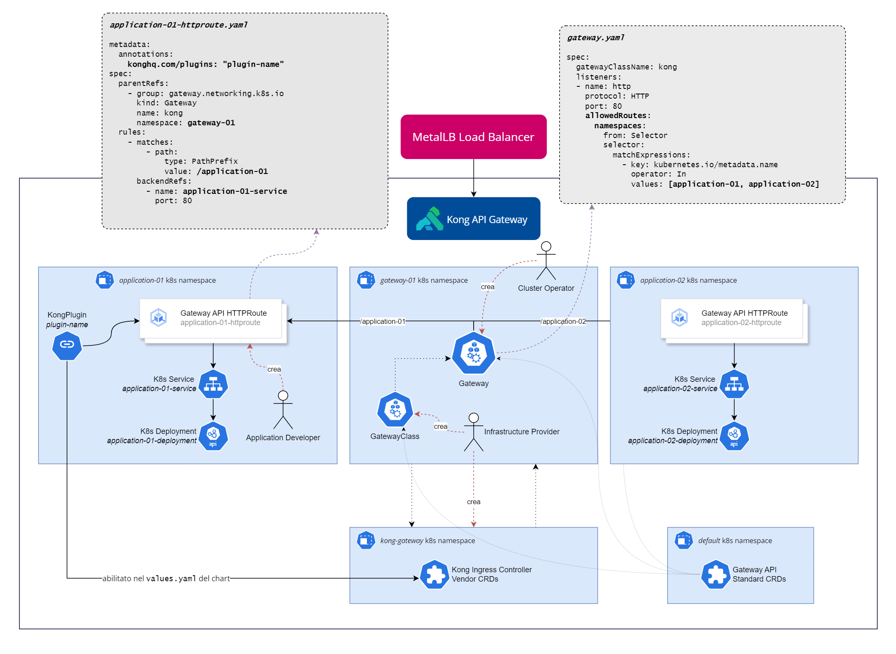

## Kong API Gateway con OIDC

Questa repository illustra come predisporre un'installazione di [Kong](https://konghq.com/) con supporto per l'autenticazione OIDC. E' anche possibile prendere d'esempio questa repository per configurare plugin diversi dall'OIDC su Kong.



**TL;DR**:
- Il funzionamento ad alto livello di Kong viene espletato tramite le Kubernetes Gateway APIs, a loro volta distribuite tramite opportuni CRDs.
- Il funzionamento a basso livello di Kong viene governato dal Kong Ingress Controller, distribuito mediante un chart Helm.
- Il plugin open-source per l'autenticazione OIDC viene iniettato mediante delle ConfigMaps all'interno del data plane di Kong.
- Tramite le Gateway APIs, viene effetutato il provisioning di una GatewayClass e di un Gateway.
- All'interno dei namespace applicativi, viene rilasciato un HTTPRoute per agganciare i(l) Service a(l) Gateway.
- All'interno nei namespace applicativi, viene agganciato un KongPlugin per associare l'HTTPRoute al plugin OIDC definito nell'Helm chart con cui è stato distribuito l'Ingress Controller.
- La configurazione dell'autenticazione OIDC viene espletata nell'oggetto KongPlugin.


Supponiamo di voler distribuire un Deployment Nginx esposto tramite un Service nel namespace `application-01`; supponiamo, inoltre, di aver schermare Nginx tramite Kong API Gateway, e moderarne l'autenticazione mediante OIDC.

Creiamo i namespace.

```bash
# Creiamo i namespace.

kubectl create ns application-01
kubectl create ns kong-gateway

# Distribuiamo le CRDs delle Gateway APIs e gli oggetti Gateway e GatewayClass specifici per Kong.

kubectl apply -f standard-install.yaml 
kubectl apply -f gateway.yaml

# Distribuiamo le ConfigMap del plugin OIDC nel namespace kong-gateway.

kubectl apply -f artifacts/configmap.plugin.oidc.yaml 
kubectl apply -f artifacts/configmap.plugin.oidc.restylib.yaml

# Distribuiamo l'Ingress Controller di Kong tramite Helm.

helm install kong charts/ingress -n kong-gateway

# Distribuiamo un oggetto KongPlugin, contenente le configurazioni del plugin OIDC, nel namespace application-01.

kubectl apply -f kong-oidc-plugin.yaml 

# Distribuiamo un Deployment, un Service e una HTTPRoute opportunamente configurate.

kubectl apply -f application-01-httproute.yaml -n application-01 
kubectl apply -f nginx.yaml -n application-01 
```


### Note

1. Il namespace `kong-gateway` viene creato a monte poichè le ConfigMap afferiscono al suo interno, assieme agli oggetti del Kong Ingress Controller.
2. L'oggetto HTTPRoute contiene una annotazione del tipo `konghq.com/plugins: oidc`, dove `oidc` coincide **esattamente** col valore di `metadata.name` all'interno dell'oggetto `KongPlugin`. **Attenzione!** L'annotazione della HTTPRoute *deve* coincidere con la proprietà di un campo `metadata.name` di un KongPlugin all'interno dello stesso namespace; non referenzia il campo `plugin` dello stesso oggetto, anche se potrebbe corrispondere con `metadata.name`.
3. L'oggetto KongPlugin contiene un campo del tipo `plugin: oidc`, dove `oidc` corrisponde al nome di un plugin configurato nel `values.yaml` dell'Helm chart del Kong Ingress Controller (campo `gateway.plugins.configMaps[].pluginName`). Dal seguente spezzone di codice, è immediato osservare perché le ConfigMap e l'Ingress Controller debbano coesistere nello stesso namespace. 

```
charts/ingress/values.yaml

gateway:
  enabled: true

  plugins:
    configMaps:
    - name: kong-oidc-plugin
      pluginName: oidc

  extraConfigMaps:
  - name: kong-oidc-resty-plugin
    mountPath: /opt/resty

  [...]
```

4. Il campo `extraConfigMaps` del `values.yaml` di cui sopra è necessario poiché il plugin OIDC si aspetta determinate dipendenze all'interno di `/opt/resty`, che siamo in grado di distribuire come ConfigMap (e quindi rilasciare le coppie chiave-valore come file individuali) all'interno della directory.
5. Le ConfigMap sono prodotte a partire dai seguenti comandi:

```
kubectl create configmap kong-oidc-plugin -n kong --from-file=src/plugins/oidc/filter.lua  --from-file=src/plugins/oidc/handler.lua  --from-file=src/plugins/oidc/schema.lua  --from-file=src/plugins/oidc/session.lua  --from-file=src/plugins/oidc/utils.lua --from-file=src/plugins/oidc/openidc.lua --dry-run=client -o yaml > artifacts/configmap.plugin.oidc.yaml

kubectl create configmap kong-oidc-resty-plugin -n kong --from-file=src/plugins/oidc/resty/evp.lua --from-file=src/plugins/oidc/resty/jwt-validators.lua --from-file=src/plugins/oidc/resty/jwt.lua --from-file=src/plugins/oidc/resty/hmac.lua --dry-run=client -o yaml > artifacts/configmap.plugin.oidc.restylib.yaml
```

6. Se si sta testando in locale quanto descritto con Minikube, è necessario aprire un tunnel per l'Ingress mediante `minikube tunnel` per assegnare un IP al Gateway.

**Attenzione.** La procedura appena descritta è stata anche sperimentata con l'Helm chart del Kong Gateway Operator, senza ottenere alcun successo. Si suggerisce di utilizzare il Kong Ingress Controller.

#### Riferimenti

- [Kong Custom Plugins](https://docs.konghq.com/kubernetes-ingress-controller/latest/plugins/custom/)
- [kong-oidc](https://github.com/revomatico/kong-oidc)
- [lua-resty-jwt](https://github.com/SkyLothar/lua-resty-jwt)
- [lua-resty-hmac](https://github.com/jkeys089/lua-resty-hmac)